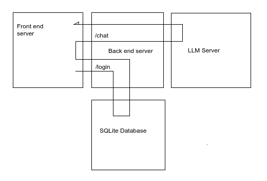
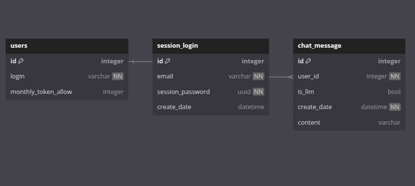

# NATURAL NEWS VIP LOGIN

## Architect



## Backend

Build with FastAPI, FastMail, Apscheduler, SQLModel.

### How to run separately?

#### Docker

```bash
$ docker build . -t backend --progress plain -f backend.Dockerfile # Build docker image

$ docker run -p 8000:8000 backend # Run docker container
```

#### Unix like OS

```bash
$ chmod +x scripts/run.sh # Add execution access

$ ./scripts/run.sh # Run the script
```

#### Windows

Go to scripts folder, right click into run.bat file, choose Run

#### OpenAPI Docs

Open your web browser, go to http://0.0.0.0:8000/docs to review routes and models

### Database schemas:




## Frontend

Build with Vue, VueRouter, VueCookies, Vue3Recaptcha, Axios

### How to run separately? [Depend on Backend for functions]

#### Docker

```bash
$ docker build . -t frontend --progress plain -f frontend.Dockerfile # Build docker image

$ docker run -p 8080:8080 frontend # Run docker container
```

#### NPM

```bash
$ cd vip-login-site # Change current path

$ npm install # Install all dependencies

$ npm run dev -- --port 8080 # Running in dev mode
```

Open your web browser, go to http://0.0.0.0:8080/ to view the web

## All project

You can run each end separately the way you want, or combine all into 1 command:

### Docker compose

```bash
docker compose up -d
```

## Todos for Production

- See [PRODUCTION.md](./docs/PRODUCTION.md)
